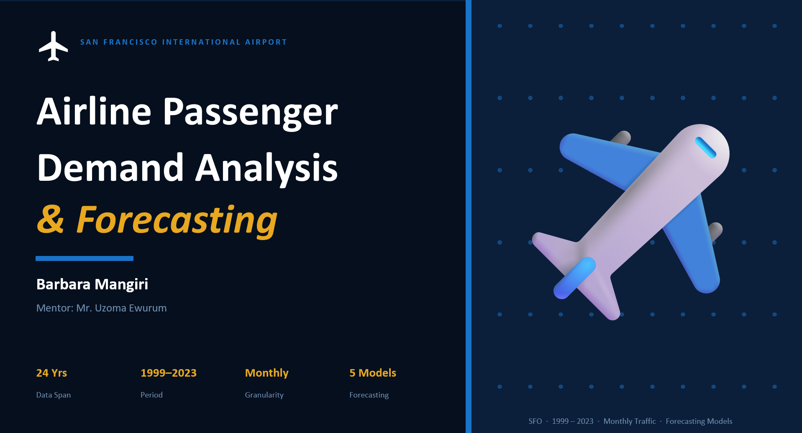

# Airline Passenger Demand Analysis & Forecast

## Project Overview

This project analyzes historical passenger traffic data from San Francisco International Airport (SFO) to identify passenger demand patterns, seasonal trends, and the most effective forecasting technique for short-term passenger demand prediction.

The analysis evaluates multiple forecasting models and compares their performance using forecasting error metrics to determine the most reliable model for operational planning and decision-making.

---

## Dataset
Monthly passenger traffic data from San Francisco International Airport (SFO), covering:

- **Period:** July 1999 – September 2023
- **Granularity:** Monthly
- **Source:** https://catalog.data.gov/dataset/air-traffic-passenger-statistics 

### Variables Used
- **Activity Period Start Date** (independent/time variable)
- **Passenger Count** (dependent variable)

---

## Analysis Objectives
The project focused on:

- Identifying seasonal passenger demand patterns
- Analyzing year-on-year passenger growth trends
- Evaluating the impact of major demand disruptions (e.g. 2020)
- Comparing forecasting models for short-term prediction
- Providing operational planning recommendations based on demand trends

---

## Forecasting Methods Tested
The following forecasting techniques were evaluated:

- Naïve Approach
- 3-Month Moving Average
- 6-Month Moving Average
- Exponential Smoothing
- Simple Linear Regression (SLR)
- Linear Forecast

---

## Evaluation Metrics
Models were evaluated using:

- Mean Absolute Error (MAE)
- Forecast Accuracy (%)

---

## Key Insights
- Passenger demand exhibits strong and consistent seasonality.
- Peak travel demand occurs during July and August.
- Passenger traffic experienced a significant decline in 2020, followed by recovery in subsequent years.
- The Naïve Approach achieved the lowest Mean Absolute Error (MAE), making it the most reliable model for short-term forecasting.

---

## Recommended Model
### Naïve Approach
The Naïve forecasting model achieved the best short-term forecasting performance with:

- **Accuracy:** 87%
- **MAE:** 274,701

This model is recommended for short-term passenger demand forecasting and operational planning.

---

## Technologies Used
- Microsoft Excel (data aggregation, analysis, and forecasting)
- Power BI (dashboard visualization)
- Microsoft PowerPoint (presentation design)
- GitHub (project hosting and documentation)

---

## Files in this Repository

### `airline_passenger_analysis_sheet.xlsx`
Excel workbook containing:
- Data aggregation
- YOY Growth
- Forecasting calculations
- Model comparison
- Error metric evaluation

### `airline_passenger_analysis_dashboard.pbix`
Power BI dashboard containing:
- Passenger demand
- Peak travel months
- Seasonality trends
- YOY Growth 
- Forecast value

### `airline_passenger_analysis_presentation.pptx`
Presentation summarizing:
- Analysis process
- Key insights
- Forecasting results
- Strategic recommendations

## Video Presentation

Watch the project presentation here:

[Project Presentation Video](https://youtu.be/RmVpOKM0Dj0)
